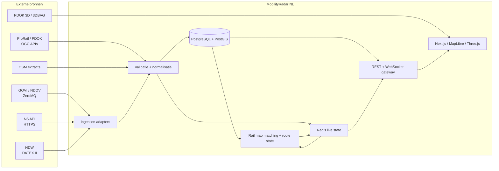

# MobilityRadar NL - doelarchitectuur

Status: **doelarchitectuur, bijgewerkt na Fase 11 op 31 augustus 2026**. Rail, road, replay en drie 3D-stations hebben nu één deploybaar fundament met PostGIS-historie, Redis-live-state, metrics, containers en reverse proxy. Niet-NS-posities, routeprediction en wegmeetwaarden blijven doelarchitectuur.

## 1. Architectuurdoelen

MobilityRadar NL moet tegelijk:

- ruwe brondata onveranderd kunnen bewaren;
- live, afgeleide en gerenderde toestand uit elkaar houden;
- treinposities transparant en vloeiend tonen zonder nieuwe GPS-metingen te suggereren;
- rail- en wegdomeinen functioneel scheiden;
- databronnen via adapters vervangbaar maken;
- bij uitval gecontroleerd degraderen;
- landelijke 2D en lokale 3D met begrensde clientbelasting leveren;
- historie en replay reproduceerbaar maken;
- juridische lineage en attributie per gegeven behouden.

De eerste release is geen microserviceslandschap. De aanbevolen start is een **modulaire monoliet met afzonderlijk schaalbare workers**, een gedeeld type-/protocolpakket en duidelijke procesgrenzen voor onbetrouwbare externe feeds.

## 2. Systeemcontext



## 3. Bounded contexts

### Rail realtime

Verantwoordelijk voor:

- raw rail observations;
- voertuig-, materieel- en ritidentiteit;
- out-of-order- en deduplicatielogica;
- data quality en source health;
- map matching;
- route progress, veilige korte prediction en stale status.

### Rail journey

Verantwoordelijk voor:

- geplande en actuele ritten;
- stationsvolgorde;
- vertragingen, annuleringen en stopwijzigingen;
- gerapporteerde sporen/perrons;
- koppeling naar live rail identity.

### Rail infrastructure

Verantwoordelijk voor:

- versieerbare bronimports;
- spoorassen, wissels, kruisingen, stations en perrons;
- topologische graph;
- niveaus, bruggen en tunnels;
- tile-/viewportproducten voor client en matcher.

### Road traffic

Verantwoordelijk voor:

- DATEX-situaties en meetwaarden;
- files, incidenten, werkzaamheden, afsluitingen en snelheidsmaatregelen;
- verkeerssnelheden en reistijden;
- eigen identifiers, versies, geldigheid en kwaliteitsstatus.

Rail en road delen infrastructuur, maar delen geen domeintabellen of impliciete identity rules.

### Source governance

Verantwoordelijk voor:

- bronregister, licentie, attributie en schema-versie;
- credentials-referenties;
- operationele health;
- feature flags en kill switches;
- quarantainestatus bij schema drift.

## 4. Monorepo-indeling

Doelstructuur voor de implementatiefase:

```text
apps/
  web/                    Next.js UI, MapLibre, Three.js
  api/                    REST + WebSocket gateway

workers/
  rail-ingestion/         GOVI/NDOV, KV6, GTFS-RT adapters
  rail-matching/          track matching en route state
  road-ingestion/         NDW DATEX II
  geo-import/             reproduceerbare PDOK/ProRail/BGT imports

packages/
  domain-rail/            railmodellen en pure regels
  domain-road/            roadmodellen en pure regels
  protocol/               versioned REST/WS schemas
  geo/                    CRS, graph en geometriefuncties
  providers/              adaptercontracten
  observability/          logging, metrics, tracecontext
  config/                 getypeerde configuratie

infra/
  docker/
  migrations/
  monitoring/

docs/
```

Geen lege services vooraf aanmaken. Iedere package ontstaat pas wanneer een vertical slice hem nodig heeft.

## 5. Technologiebesluiten

| Onderdeel | Keuze | Reden |
|---|---|---|
| Taal | TypeScript, strict | Gedeelde domein- en protocoltypes; snelle eerste release |
| Web | Next.js + React | Product-UI, serverrendering voor niet-realtime routes |
| 2D kaart | MapLibre GL JS | Open webkaartstack en custom layers |
| 3D | Three.js als MapLibre custom layer | Een coordinate-/cameramodel en directe WebGL-controle |
| Client state | Zustand | Kleine, expliciete live state slices |
| Persistent data | PostgreSQL + PostGIS | Spatial indexing, versieerbare geometrie, historie |
| Live state | Redis | Atomische actuele state, pub/sub/fanout, dedupe en korte caches |
| Realtime transport | WebSocket | Delta-updates en viewportabonnementen |
| Niet-realtime API | REST | Zoeken, detail, historie en bootstrap |
| Validatie | Zod + XML/XSD/protobuf-specifieke decoder | Scheiding tussen wire en domein |
| Deployment | Docker Compose eerst | Reproduceerbare lokale stack zonder vroege microservices |
| Metrics | OpenTelemetry + Prometheus-contract | Eind-tot-eind latency en source health als kernfunctionaliteit |

Go is pas gerechtvaardigd na profiling van decode-, map-match- of fanoutbelasting. Het is geen fase-1 standaardkeuze.

## 6. Onveranderlijke datalagen

Iedere live positie doorloopt vier expliciete lagen:

```text
RAW OBSERVATION
  bronpayload + echte brontimestamps
        |
        v
NORMALIZED OBSERVATION
  eenheden/CRS/identity genormaliseerd, inhoud niet mooier gemaakt
        |
        v
DERIVED STATE
  map match, routeprogress, afgeleide snelheid, prediction, confidence
        |
        v
RENDER STATE
  clientinterpolatie op een specifiek rendertijdstip
```

Regels:

- Raw records zijn append-only en worden nooit overschreven met een matchresultaat.
- Normalisatie voegt metadata toe maar verandert onbekend niet in een defaultwaarde.
- Derived state verwijst naar de gebruikte raw observation(s), geometrieversie en algoritmeversie.
- Render state is vluchtig en wordt niet als GPS-waarheid opgeslagen.
- Iedere API-/WS-response bevat herkomst en status die de UI zonder inferentie kan tonen.

## 7. Tijdmodel

Verplichte tijden:

```text
sourceMeasuredAt       meettijd van GPS/sensor, indien aanwezig
sourceGeneratedAt      berichtgeneratie bij bron
sourcePublishedAt      publicatietijd van feed/snapshot
receivedAt             eerste ontvangst door onze adapter
normalizedAt           succesvolle domeinvalidatie
derivedAt              moment map-match/prediction
sentAt                 gateway verzending
clientReceivedAt       client ontvangst
renderedAt             lokale renderclock
```

Geen van deze velden mag stilzwijgend een ander veld vervangen. Onbekende tijden blijven `null` met een reason code.

Bronleeftijd:

```text
sourceAge = now - sourceMeasuredAt
```

Alleen wanneer `sourceMeasuredAt` ontbreekt mag de UI een apart gelabelde `publicationAge` tonen. `receivedAt` is nooit bewijs van een recente meting.

## 8. Provenance- en kwaliteitsmodel

Ieder extern of afgeleid veld krijgt conceptueel:

```text
value
availability: KNOWN | UNKNOWN | NOT_APPLICABLE
origin: SOURCE | DERIVED | ESTIMATED | SCHEDULED
sourceId
sourceRecordId
sourceSchemaVersion
sourceMeasuredAt
receivedAt
qualityFlags[]
methodId?              alleen voor afleiding
methodVersion?
confidenceClass?       HIGH | MEDIUM | LOW | UNKNOWN
confidenceScore?       alleen indien gekalibreerd en gedocumenteerd
```

Een interne candidate score van de matcher is niet automatisch een kanspercentage. De UI toont pas een percentage wanneer kalibratie met gelabelde waarheid aantoont dat dit statistisch verdedigbaar is. Tot die tijd toont de UI een klasse en debugdetails.

## 9. Providercontracten

Adapters mogen alleen wiretypes buiten de domeinlaag kennen.

```ts
interface ProviderLifecycle {
  start(signal: AbortSignal): Promise<void>;
  health(): ProviderHealth;
}

interface RailPositionProvider extends ProviderLifecycle {
  stream(): AsyncIterable<RawRailEnvelope>;
}

interface JourneyProvider extends ProviderLifecycle {
  streamChanges?(): AsyncIterable<RawJourneyEnvelope>;
  getJourney?(key: ExternalJourneyKey): Promise<RawJourney | null>;
}

interface RoadProvider extends ProviderLifecycle {
  streamOrPoll(): AsyncIterable<RawRoadEnvelope>;
}
```

Een adapter levert raw envelope, payload bytes/hash, transportmetadata en parse-uitkomst. Normalisatie is een aparte laag zodat een decoderupdate niet ongemerkt domeinregels wijzigt.

## 10. PostgreSQL/PostGIS ontwerp

### Bronadministratie

- `source_registry`
- `source_schema_version`
- `source_license_snapshot`
- `ingest_run`
- `ingest_error`

### Rail raw en genormaliseerd

- `rail_raw_message` - payload/objectstorageverwijzing, hash, envelope, tijden;
- `rail_position_observation` - raw GPS/kwaliteit per materieeldeel;
- `rail_journey_snapshot` - bronritversie;
- `rail_journey_stop_snapshot` - stationstijden, status, reported track;
- `rail_vehicle_identity` - provider-scoped identifiers;
- `rail_identity_link` - tijdsgebonden koppeling tussen materieel, voertuig en rit.

### Rail afgeleid

- `rail_match_result` - observation, edge, progress, scorecomponenten, methode;
- `rail_route_hypothesis` - geordende edges en status `CONFIRMED_BY_SOURCE`, `INFERRED`, `SCHEDULED`;
- `rail_derived_state_history` - compacte replay-/auditstate;
- `rail_anomaly` - GPS jump, out of order, identity conflict, stale.

### Infrastructuur

- `geo_dataset_version`
- `rail_track_source_feature`
- `rail_graph_node`
- `rail_graph_edge`
- `rail_switch_geometry`
- `station`
- `platform_geometry`
- `station_platform_association`

Geometrie wordt opgeslagen met expliciete SRID. Import en metrische analyse gebeuren bij voorkeur in EPSG:28992; API-output is EPSG:4326; webprojectie is EPSG:3857. Lokale 3D gebruikt een ENU/local-Cartesian oorsprong.

### Road

- `road_raw_message`
- `road_event_snapshot`
- `road_event_version`
- `road_measurement_site_version`
- `road_speed_observation`
- `road_travel_time_observation`
- `road_anomaly`

### Indexen

- GiST/SP-GiST op geometrie;
- btree op provider + external id + source time;
- BRIN op grote append-only tijdreeksen;
- unieke dedupe-index op provider, event identity, source version/time en payload hash;
- partities per maand voor raw/historie zodra volume dat rechtvaardigt.

Raw payloads kunnen na een configureerbare grootte in object storage staan; de database bewaart checksum, contenttype, compressie en immutable locator. Dit mag alleen wanneer de bronlicentie opslag toestaat.

## 11. Railgraph

### Nodes

- echte wissels;
- fysieke aansluitpunten;
- spooruiteinden;
- niveaugescheiden kruisingen alleen wanneer werkelijk verbonden;
- stationsspecifieke graph nodes.

### Edges

```text
id
from_node_id
to_node_id
geometry_28992
length_m
directionality
layer / z-level
bridge / tunnel / covered
station_area_id
source_feature_id
dataset_version_id
inferred
```

Importstappen:

1. download en checksum;
2. metadata-/licentiesnapshot;
3. schema- en geometrievalidatie;
4. transformeer naar EPSG:28992;
5. split op echte graphknooppunten;
6. voorkom verbinding op alleen geometrische kruising;
7. bouw connectiviteit en edge measures;
8. genereer tileproducten en stationcandidates;
9. activeer versie atomisch na QA.

Een oude graphversie blijft beschikbaar voor replay van historische matches.

## 12. Map matching

Candidate generation gebruikt een configureerbare zoekradius rond raw GPS. Scorecomponenten:

- afstand tot edge;
- heading alignment, met lager gewicht bij lage snelheid;
- continuiteit met vorige edge/progress;
- topologische bereikbaarheid binnen plausibele afstand;
- relatie tot rit/stationsvolgorde;
- GPS quality (fix, HDOP, satellieten);
- plausibele snelheid/acceleratie;
- penalties voor parallelspoor-sprongen en niveauconflicten.

De in de briefing genoemde gewichten zijn een start-hypothese, geen productieconfidence. Ze moeten op Utrecht-scenario's en later gelabelde landelijke trajecten worden gekalibreerd.

Resultaten:

- `MATCHED_HIGH`, `MATCHED_MEDIUM`, `MATCHED_LOW`;
- `UNMATCHED_NO_CANDIDATES`;
- `UNMATCHED_AMBIGUOUS`;
- `REJECTED_SUSPICIOUS_OBSERVATION`.

Bij lage confidence blijft raw GPS beschikbaar; de UI mag een zachte/snapped marker alleen met de juiste status tonen.

## 13. Live state in Redis

Voorbeeldkeys:

```text
rail:vehicle:{internalVehicleId}:source
rail:vehicle:{internalVehicleId}:derived
rail:journey:{internalJourneyId}:current
rail:viewport:{cellId}:members
road:event:{internalEventId}:current
road:viewport:{cellId}:members
source:{sourceId}:health
dedupe:{sourceId}:{hash}
```

Regels:

- actuele state wordt atomisch geschreven;
- TTL is langer dan stale threshold maar eindig;
- pub/sub transporteert identifiers en versies, geen complete nationale snapshots;
- Redis is niet de auditbron; herstel komt uit recente Postgres-state plus nieuwe feeds;
- viewportindices zijn afgeleid en mogen worden herbouwd.

## 14. REST en WebSocket

### REST

Geschikt voor:

- bootstrap van viewport;
- stations zoeken/detail;
- ritdetail;
- bron- en licentie-informatie;
- historische/replayqueries;
- infrastructuurtiles en station detail bundles.

### WebSocket

Protocol is versieerbaar en delta-gebaseerd:

```json
{
  "protocolVersion": 1,
  "type": "rail.vehicle.delta",
  "sequence": 123456,
  "sentAt": "2026-08-20T18:20:10.123Z",
  "data": {
    "vehicleId": "rail:...",
    "stateVersion": 42,
    "source": {},
    "derived": {},
    "quality": {}
  }
}
```

Client stuurt viewport, zoom, gewenste domeinen/lagen en optioneel gevolgde trein. Server valideert grenzen en beperkt abonnementsfrequentie. Een gevolgde trein blijft ontvangen buiten viewport; nationale detailupdates worden nooit standaard naar iedere client gestuurd.

Snapshot/delta herstel:

1. connect met protocolversie;
2. subscribe;
3. server stuurt snapshot met `snapshotSequence`;
4. daarna delta's;
5. sequence gap leidt tot resync van alleen de scope;
6. reconnect gebruikt backoff met jitter.

## 15. Clientarchitectuur

### MapLibre

- basemap;
- stations en lage/middenzoom treiniconen;
- route-, debug- en verkeerslagen;
- clustering/labelselectie;
- vector tiles.

### Three.js custom layer

- lokale procedurele rails;
- wisselgeometrie;
- treinmodellen en bakken;
- station/perron/detailassets;
- beperkte bovenleiding en nabijheidsdetails.

### State slices

- `connectionState`;
- `viewportSubscription`;
- `railSourceState`;
- `railRenderState`;
- `roadState`;
- `selection/follow`;
- `layerPreferences`.

Source state wordt alleen door netwerkdelta's gewijzigd. Render state wordt met `requestAnimationFrame` berekend en schrijft niet terug naar source state.

## 16. 3D streaming en coordinate precision

### Zoom/LOD-strategie

| Context | Weergave |
|---|---|
| Landelijk | 2D markers, vereenvoudigde spoor-/weglagen |
| Regio | labels met decluttering, routehighlight |
| Stationaanloop | individuele spoorassen, lage-detail treinen |
| Station detail | lokale 3D rails, perrons, wissels, gebouwen en terrein |
| Zeer dichtbij | hogere train LOD, sleepers/ballast, optionele masten/draden |

Utrecht Centraal is de eerste geprecomputeerde detailzone. De client krijgt een station bundle met graphfragment, rendercurves, platformassociaties, bounds, datasetversies en assetmanifest.

Wereldcoordinaten worden bij binnenkomst geconverteerd naar een stationgebonden lokale oorsprong in meters. Three.js gebruikt die lokale waarden om floating-point jitter te voorkomen. MapLibre blijft de gezaghebbende camera/projection host.

3D Tiles:

- uitsluitend viewportgebaseerd;
- frustum- en afstandsculling;
- begrensde gelijktijdige downloads;
- LRU cache met memory budget per deviceklasse;
- tiles worden ontladen buiten hysteresisbounds;
- bronjaar en attribution blijven zichtbaar.

## 17. Treincompositie en positieconventie

Een bronpositie hoort primair bij een materieeleenheid/GPS-unit, niet automatisch bij de kop van de hele trein. Intern:

```text
positionReference = GPS_ANTENNA | VEHICLE_UNIT | FRONT | CENTER | UNKNOWN
```

Een volledige compositie wordt alleen gebruikt wanneer bron en identity link betrouwbaar zijn. Iedere bak krijgt een afstandsoffset langs dezelfde routecurve; geen starre treinmesh door een boog. Wanneer lengtes onbekend zijn, render een generiek enkel voertuig of een bronneutraal symbool en label samenstelling onbekend.

## 18. Prediction- en stalebeleid

Thresholds zijn bron- en empirisch geconfigureerd, niet hard gecodeerd als universele waarheid.

Conceptueel:

```text
FRESH_SOURCE        recente betrouwbare observatie
INTERPOLATED        render tussen bekende/vertrouwde states
PREDICTED           voorbij laatste observatie, korte begrensde horizon
STALE               bronleeftijd boven threshold
HIDDEN_OR_STATIC    predictionhorizon overschreden of kwaliteit te laag
```

Prediction gebruikt routeafstand, begrensde snelheid/acceleratie en bekende routehypothese. Bij een wissel kiest de engine een rit-/graphhypothese; hij publiceert nooit `actualSwitchState` zonder operationele bron.

## 19. Security

- Alle externe feeds zijn onbetrouwbare input.
- XML parsing heeft DTD/external entities uitgeschakeld, payload- en nestinglimieten en schema-validatie.
- Protobuf/GTFS-RT en JSON hebben size-, entity- en recursionlimieten.
- Gzip decompression heeft compressed- en expanded-size limieten tegen zip bombs.
- Credentials staan alleen in secrets/configuration, nooit in clientbundles of logs.
- NS API-calls lopen via server-side adapter met caching, timeouts en rate limits.
- WebSocket valideert origin, berichtschema, bounds en abonnementsfrequentie.
- Publieke detailroutes krijgen rate limiting en response size limits.
- Raw payloadweergave in debug/admin is gesanitized en standaard niet publiek.
- Containerprocessen draaien non-root met read-only filesystem waar praktisch.
- Dependencies, images en GLB-assets worden gescand; assets hebben licentiemanifest en checksum.

## 20. Resilience

Per provider:

- connect/read timeout;
- exponential reconnect met jitter;
- circuit breaker;
- schema-drift quarantine;
- last-good state met zichtbare stale status;
- onafhankelijke kill switch;
- geen automatische productie-mockfallback.

De UI blijft bruikbaar wanneer een bron uitvalt:

- basemap en statische infrastructuur blijven zichtbaar;
- getroffen laag krijgt `DEGRADED`/`OFFLINE`;
- markers stoppen, vervagen of worden verborgen volgens stalebeleid;
- andere bronnen en domeinen blijven functioneren.

## 21. Observability

Minimale metrics:

```text
source_connected
source_last_message_age_seconds
source_messages_total
source_decode_errors_total
source_schema_rejections_total
source_duplicate_total
source_out_of_order_total
source_payload_bytes
observation_source_age_seconds
ingest_latency_seconds
normalize_latency_seconds
map_match_latency_seconds
map_match_result_total{class}
prediction_horizon_seconds
ws_clients
ws_messages_total
ws_bytes_total
ws_resync_total
client_render_delay_seconds
```

Logs zijn structured en bevatten correlation/source record ids, nooit API keys of volledige gevoelige payloads. Traces verbinden ingest, normalisatie, matching, fanout en waar beschikbaar client acknowledgement.

## 22. Deploymenttopologie

### Development

```text
web
api-websocket
rail-ingestion
road-ingestion
rail-matching
geo-import (on demand)
postgres-postgis
redis
object-storage emulator (alleen indien nodig)
metrics stack
```

### Eerste productie

- web en API achter reverse proxy/load balancer;
- een actieve consumer per niet-deelbare feed, met leader lock;
- afzonderlijk schaalbare matching/fanout workers wanneer gemeten nodig;
- managed PostgreSQL/PostGIS en Redis met backups;
- object storage/CDN voor 3D-assets en grote immutable imports;
- blue/green of rolling deployment met protocolcompatibiliteit;
- geen vroegtijdige opsplitsing in tientallen services.

## 23. Fasering en gates

### Fase 0 - research

Deliverables: deze drie documenten. Gate: bron-, licentie-, auth- en endpointstatus is expliciet; onbekenden staan open.

### Fase 1 - een echte trein

- een echte Interface 5-observatie ontvangen;
- raw opslaan;
- timestamp/provenance correct tonen;
- nog geen spoor-snapping claimen.

Gate: 24-uurs feedmeting, schema validation, data quality UI, tests en documentatie.

### Fase 2 - alle beschikbare treinen

- actuele NS-dekking;
- identiteit/dedupe/out-of-order;
- viewport WebSocket;
- stalebeleid.

### Fase 3 - journey enrichment

- InfoPlus RIT;
- stations, volgende halte, tijden en reported track;
- NS API uitsluitend gecacht aanvullend.

### Fase 4 - clientinterpolatie

- source versus render state;
- 60 FPS waar device het toelaat;
- reduced motion;
- zichtbare interpolated/predicted status.

### Fase 5 - ProRail/PDOK import

- volledige, versieerbare PDOK OGC-import van spooras, wissel, kruising en station;
- operationele landelijke graaf uit objecten met status `Bestaand`;
- lijn-eindpunten als nodes, inclusief officiële wisselgeometrie, zonder kruisingen automatisch te verbinden;
- lokale bbox-grid en PostGIS GIST-schema;
- gecomprimeerde landelijke GeoJSON-kaartlaag en bronmanifest.

### Fase 6 - Utrecht map matching

- kandidaatgeneratie binnen 75 meter via de graph bbox-grid;
- afstand-, heading-, GPS-kwaliteit-, continuïteit- en topologiescores;
- scenario-gekalibreerde matchklassen zonder candidatescore als kanspercentage te presenteren;
- expliciete ambiguïteit op parallelsporen en afwijzing van verdachte GPS-sprongen;
- afzonderlijke raw GPS- en derived match-state;
- raw/snapped verbindingslijn, kandidaatsporen, scores en gekozen edge als debugvisuals;
- voorbereid PostGIS-model voor raw en matched geometrie met afzonderlijke GIST-indexen.

### Fase 7 - landelijke matching

- landelijke kandidaatgeneratie via dezelfde bbox-grid en een expliciete Nederlandse werk-bbox;
- schaal-, uitkomst- en afstandsmeting op de actuele vloot, zonder dit als gelabelde accuracy te presenteren;
- reproduceerbare graph-audit per zone van 0,25° voor ongeldige, extreem korte/lange edges, dangling nodes en kleine componenten;
- zichtbare zonekwaliteit `NORMAL`, `CAUTION`, `SPARSE` of `BLOCKED` in protocol en UI;
- regionale 125-meterfallback alleen bij nul primaire kandidaten en uitsluitend in `NORMAL`-zones;
- fallbackresultaten verplicht als `MATCHED_LOW_REGIONAL_FALLBACK`, met reden en effectieve straal;
- aparte landelijke match-state, REST-snapshot, WebSocket-stroom en healthstatus.

### Fase 8 - 3D Utrecht

- versieerbare stationbundel met graphfragment, lokale rendercurves, BGT-perrons, bronversies en assetbudget;
- lokale metercoördinaten met officiële ProRail-stationspositie als oorsprong en vaste `EAST/NORTH/UP`-assen;
- procedurele linker-/rechterrail, ballast, dwarsliggers en wisselcurves via één gedeelde Three.js/MapLibre-context;
- actuele perronvlakken uit de dagelijkse BGT-collectie `kunstwerkdeel_vlak`, zonder historische versies;
- afzonderlijke curveplaatsing per bak, aangetoond met een expliciet niet-live techniekmodel;
- live materiaal als één neutrale unit zolang GPS-referentie, baklengte en samenstelling niet bewezen zijn;
- PDOK 3D Basisvoorziening 2025 voor gebouwen en AHN-gebaseerd terrein via viewportgestuurde 3D Tiles;
- LRU-unloading, maximaal vier tile-downloads, twee parses en devicebudgetten van 96/192/256 MB;
- detailzone laadt alleen na expliciet openen en ruimt alle tile- en WebGL-state op bij sluiten.

### Fase 9 - road

- Actueel Beeld via de officiële open NDW DATEX II v3-feed;
- files, incidenten, werkzaamheden, afsluitingen en veiligheidsmeldingen;
- volledige snapshotsemantiek, bronversies, geldigheid en brongeometrie;
- file-backed ontwikkelstate plus Redis-contract en voorbereid PostGIS-schema;
- snelheid/reistijd met meetlocatiereferenties schuift bewust door naar een volgende vertical slice.

### Fase 10 - generalisatie/replay

- deterministische raw replay met afzonderlijke bron-, afleidings- en renderstatus;
- GPS-tijdgestuurde tijdlijn met graph-hash en versiegepinde herberekening;
- één lokale 3D-bundelketen voor Utrecht, Amsterdam en Rotterdam Centraal;
- begrensde replayvensters en eventloop-yields voor voorspelbare gatewaybelasting;
- geen materieeltype of niet-NS-operator zonder bewezen bron.

### Fase 11 - productierijp fundament

- PostGIS-versiehistorie voor railobservaties, afgeleide matches, InfoPlus-ritten en NDW-events;
- Redis blijft aparte kortlevende live-state en pub/sub;
- Prometheus-metrics en persistence-health op de realtime gateway;
- productiecontainers voor migratie, bronbootstrap, gateway, web, PostGIS en Redis;
- Nginx als same-origin REST/WebSocket-proxy met begrenzing en securityheaders;
- CI voor typecheck, lint, tests, build, server-rendering en productie-audit;
- fail-fast persistence in productie, file-backed fallback in ontwikkeling.

Iedere fase is pas klaar na tests, typecheck, lint, build, relevante integration test, performancecheck, documentatie en bekende beperkingen.

## 24. Architectuurbesluiten die niet mogen verwateren

1. Browser verbindt nooit rechtstreeks met ZeroMQ of geheime externe API's.
2. Raw, normalized, derived en render state zijn afzonderlijk.
3. Onbekend blijft onbekend; `null` is geldige domeininformatie.
4. Geen live label zonder recente realtime bron.
5. Interpolatie is rendering, geen GPS-meting.
6. Route inference is geen wisselstand.
7. Reported track is geen bewezen platformgeometrie.
8. Confidence is geen willekeurig percentage.
9. Rail en road houden aparte domeinmodellen.
10. Bron- en geometrieversies blijven reproduceerbaar.
11. Geen scraping wanneer een officiele/open bron bestaat.
12. Performance-optimalisatie volgt meting; datatransparantie is vanaf dag een verplicht.

## 25. Bekende architectuurrisico's

| Risico | Gevolg | Beheersing |
|---|---|---|
| Oude GPS in actuele batch | Marker lijkt live maar is oud | meettijdgebaseerde stale state |
| Verkeerde rit/materieelkoppeling | Verkeerde treininfo bij marker | identity links met tijdvenster en conflictstatus |
| Parallelsporen | Onjuiste spoorselectie | topology, history, routeprior en ambiguity state |
| Schemawijziging feed | Stille datacorruptie | versioned decoder + quarantine |
| Tijdelijke InfoPlus-inconsistentie | spoor/tijd spreekt zichzelf tegen | versie-/tijdselectie en kortstondige quality flag |
| Externe 3D-service traag | stationdetail faalt | cache/CDN, LOD, fallbackweergave |
| Browserbelasting | lage FPS/geheugencrash | viewport, LOD, instancing, budgets |
| Licentieverschillen | ongeoorloofde redistributie | source registry en deployment gate |
| WebSocket fanout | hoge kosten/latency | spatial subscriptions en delta's |
| Voorspelling loopt door | fictieve precisie | harde horizon en stale/hide state |

## 26. Besluit voor implementatiestart

De architectuur is gereed om fase 1 te starten zodra de in `data-sources.md` genoemde bron- en licentiegates zijn afgerond. De eerste code moet een smalle end-to-end slice bouwen: **een echte raw treinobservatie, onveranderd opgeslagen, genormaliseerd met expliciete timestamps en via een versioned API zichtbaar gemaakt**. UI-polish, landelijke graphbouw en 3D volgen pas nadat die waarheidsketen aantoonbaar klopt.
