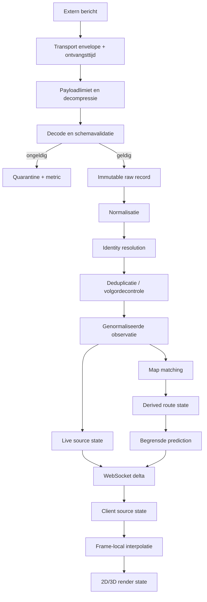
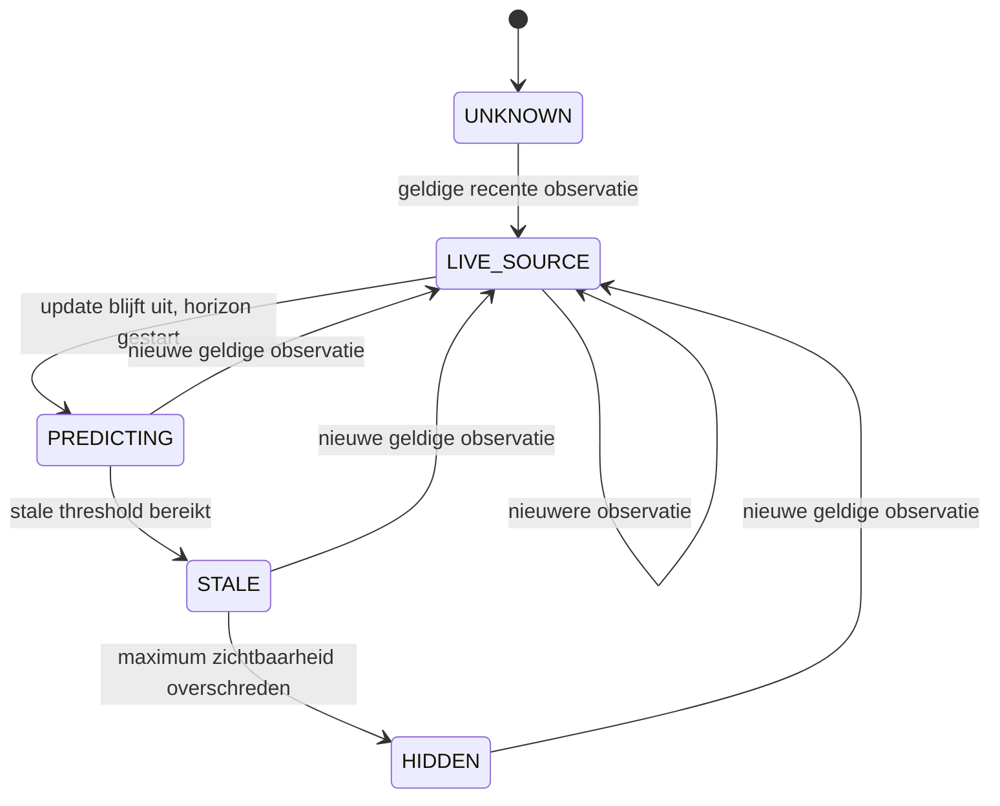
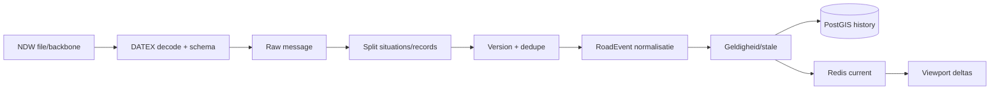

# MobilityRadar NL - realtime pipeline

Status: **fase-0 ontwerp, 20 augustus 2026**. Dit document definieert de waarheidsketen van externe bron tot scherm. Het is normatief voor de implementatiefase.

## 1. Kernregel

Een vloeiend bewegende marker bewijst alleen dat de renderer vloeiend werkt. Hij bewijst niet dat er een nieuwe GPS-meting is ontvangen.

De pipeline moet voor ieder zichtbaar gegeven kunnen antwoorden:

```text
Wat zei de bron?
Wanneer heeft de bron dit gemeten?
Wanneer ontvingen wij het?
Wat hebben wij genormaliseerd?
Wat hebben wij afgeleid?
Wat wordt alleen voor deze frame gerenderd?
Hoe oud en hoe betrouwbaar is elk deel?
```

## 2. End-to-end overzicht



## 3. Berichtenenvelope

Iedere ontvangen payload krijgt eerst transportmetadata, nog voor decoding:

```text
messageId                 intern UUID/ULID
sourceId
transport                 ZEROMQ | HTTPS_PULL | HTTPS_PUSH
topicOrUrl
receivedAt                monotone-wallclock combinatie
contentType
contentEncoding
compressedBytes
payloadSha256
remoteMetadata            veilige subset van headers/envelope
decoderExpectedVersion
```

`receivedAt` wordt gezet op het eerste byte-/framecontact in de adapter, niet na parsing. Een monotonic clock wordt gebruikt voor duurmetingen; UTC wall clock voor audit en uitwisseling.

## 4. Veilig decodepad

### XML/DATEX/InfoPlus/KV6

1. begrens compressed bytes;
2. streaming decompress met maximum expanded bytes en ratio;
3. UTF-8/encodingcontrole;
4. DTD en external entities uit;
5. limieten op elementdiepte, aantal nodes en textlengte;
6. parse naar wiremodel;
7. valideer relevante XSD-/profielregels;
8. onbekende velden registreren, niet automatisch negeren;
9. bewaar raw payload/checksum voor audit volgens licentie en retentie.

### GTFS-Realtime/protobuf

1. payloadlimiet;
2. protobuf decode met bekende schema-versie;
3. limiet op entities en nested carriage details;
4. presence checks voor optionele velden;
5. valideer feedheader, timestamps en identifiers;
6. behoud unknown-field/schema-drift signaal waar library dat ondersteunt.

### JSON/NS API/PDOK

1. status-, contenttype- en groottecontrole;
2. strikt schema op gebruikte responsevariant;
3. rate-limit/backoff headers vastleggen;
4. responsecache met productconforme TTL;
5. onverwachte shape naar quarantine, niet naar gedeeltelijke defaults.

Een parsefout overschrijft nooit de laatste goede live state. De source health kan wel naar `DEGRADED_SCHEMA` gaan.

## 5. Raw persistence

Raw opslag is append-only:

```text
rail_raw_message
  id
  source_id
  envelope
  source_schema_version
  received_at
  payload_sha256
  payload_bytes | object_locator
  parse_status
  parse_error_code
  ingest_run_id
```

Het opslaan van volledige payloads is onderworpen aan bronvoorwaarden. Als full raw retention niet is toegestaan, bewaart het systeem minimaal toegestane metadata, checksum, decoderuitkomst en genormaliseerde bronvelden. Deze reductie wordt in het bronregister gemotiveerd.

## 6. Normalisatiecontract

Normalisatie doet alleen:

- typeconversie;
- eenheden expliciet maken;
- CRS correct omzetten;
- timestamps parseren zonder tijd te verzinnen;
- provider-scoped identifiers construeren;
- source metadata toevoegen;
- bekende sentinelwaarden (`-1`, leeg, invalid fix) naar `UNKNOWN` met reason code vertalen.

Normalisatie doet niet:

- GPS naar spoor snappen;
- snelheid berekenen;
- ontbrekende samenstelling aanvullen;
- geplande informatie live noemen;
- een ontbrekende timestamp vervangen door ontvangsttijd;
- afwijkende data stil verwijderen.

## 7. Railpositieobservatie

Normatief model:

```text
observationId
sourceId
sourceRecordKey
externalTrainNumber?
externalVehicleId?
externalMaterialUnitId?
materialSequence?

sourceMeasuredAt?
sourceGeneratedAt?
sourcePublishedAt?
receivedAt

positionWgs84?           exact bronpunt
elevationValue?
elevationReference?      WGS84_ELLIPSOID | GEOID_NAP_LIKE | UNKNOWN
measuredSpeedKmh?
headingDegrees?
orientationDegrees?
travelDirectionCode?
gpsFix?
hdop?
satelliteCount?

positionReference        GPS_ANTENNA | VEHICLE_UNIT | FRONT | CENTER | UNKNOWN
qualityFlags[]
rawMessageId
```

Voor NStreinposities blijft `positionReference` standaard `VEHICLE_UNIT` of `UNKNOWN`, tenzij actuele broninformatie een preciezer referentiepunt bewijst.

## 8. Identity resolution

### Principes

- `TreinNummer` is rit-/dienstidentiteit, niet hetzelfde als materieelnummer.
- `MaterieelDeelNummer` identificeert een unit, niet automatisch de hele trein.
- provider en operationele datum zijn onderdeel van externe sleutels.
- links zijn tijdsgebonden en hebben bron plus bewijsstatus.
- een conflict wordt gemodelleerd, niet door last-write-wins verborgen.

### Linktypen

```text
MATERIAL_UNIT_TO_VEHICLE
VEHICLE_TO_JOURNEY
JOURNEY_TO_SERVICE
REPORTED_PLATFORM_TO_GEOMETRY
```

### Linkstatus

```text
SOURCE_EXPLICIT
SOURCE_CORRELATED
INFERRED_HIGH
INFERRED_AMBIGUOUS
CONFLICTING
EXPIRED
```

Alleen `SOURCE_EXPLICIT`, `SOURCE_CORRELATED` met bewezen regel en gekalibreerde `INFERRED_HIGH` mogen live compositie of ritdetail automatisch koppelen. De rest blijft debugbaar maar verschijnt niet als zekerheid.

## 9. Deduplicatie

Dedup key gebruikt niet alleen timestamp:

```text
sourceId
message/envelope type
provider-scoped vehicle or event identity
source version/timestamp
canonical content hash
```

Reden: twee berichten kunnen dezelfde timestamp maar verschillende inhoud hebben. Een exact duplicate verhoogt metric en stopt voor live state, maar mag in een compacte ingest-audit worden geteld.

Voor InfoPlus- en NDW-snapshots geldt:

- gelijke record id + gelijke version + gelijke hash: duplicate;
- gelijke id + hogere version: update;
- gelijke id + gelijke version + andere hash: source conflict/anomaly;
- lagere version of oudere brontijd: historische correctiekandidaat, niet terugzetten in live state.

## 10. Out-of-order behandeling

Live state heeft per entiteit een source ordering key:

```text
sourceVersion
sourceMeasuredAt/sourceVersionTime
sourceGeneratedAt
receivedAt               alleen laatste tie-breaker
```

Een ouder bericht:

- wordt indien toegestaan historisch bewaard;
- verhoogt `source_out_of_order_total`;
- kan een eerdere raw/historische record corrigeren;
- mag de actuele marker niet terug in de tijd zetten;
- veroorzaakt geen afwijzing van een latere, inhoudelijk verschillende correctie zonder bronversie.

Provideradapters definiëren expliciet hun orderingstrategie; er is geen universele timestampvolgorde.

## 11. GPS- en positievalidatie

Een observation krijgt flags, niet alleen pass/fail:

```text
NO_FIX
MISSING_COORDINATE
ZERO_COORDINATE
OUTSIDE_EXPECTED_COVERAGE
SOURCE_TIME_MISSING
SOURCE_TIME_IN_FUTURE
SOURCE_TOO_OLD
HDOP_POOR
SATELLITES_LOW
IMPOSSIBLE_JUMP
IDENTITY_CONFLICT
HEADING_UNRELIABLE_LOW_SPEED
```

Impossible jump:

```text
route_or_geodesic_distance / source_time_delta > configured_physical_limit
```

De grens is materieel-/contextgebonden en omvat meetmarge. Een suspicious punt wordt raw bewaard en kan in debug zichtbaar zijn, maar wordt niet automatisch match truth.

## 12. Source state machine voor rail



Statusberekening gebruikt echte `sourceMeasuredAt` waar beschikbaar. Een nieuwe batch met een oude GPS-tijd houdt de trein stale.

`Data: LIVE` en `Render: INTERPOLATED` kunnen tegelijk waar zijn. Het zijn verschillende dimensies.

## 13. Rail map-matching pipeline

### Invoer

- geldige raw/normalized WGS84-observatie;
- vorige aanvaarde match;
- actieve graphversie;
- rit/stationsvolgorde waar bekend;
- heading, speed en GPS quality waar bekend.

### Stap 1 - CRS

Transformeer EPSG:4326 naar EPSG:28992 voor metrische zoek- en afstandsfuncties. Lat/lon wordt nooit als meter gebruikt.

### Stap 2 - candidates

Gebruik `ST_DWithin` rond raw punt met bron-/kwaliteitafhankelijke maar begrensde radius. Haal per edge op:

- closest point;
- perpendicular distance;
- normalized/meter progress;
- local tangent/azimuth;
- graph node context;
- layer/bridge/tunnel;
- dataset version.

### Stap 3 - features

Per candidate:

```text
distance score
heading score
previous-edge continuity
reachable route distance
journey/next-stop compatibility
GPS quality contribution
speed/acceleration plausibility
parallel-track switch penalty
level-crossing penalty
```

Heading krijgt weinig of geen gewicht bij lage bron-/afgeleide snelheid. Een GPS heading ontbreekt of is onbetrouwbaar dan zonder default 0 graden.

### Stap 4 - topology

Bereken of candidate vanaf vorige edge via graph binnen een plausibele routeafstand bereikbaar is. Euclidische nabijheid alleen is onvoldoende bij parallelsporen, emplacementen, tunnels, bruggen en kruisingen.

### Stap 5 - route prior

Rit/stationsvolgorde kan een branch prior geven. Deze prior betekent `inferred route`, niet `confirmed route` en nooit `current switch state`.

### Stap 6 - keuze/ambiguity

- beste candidate alleen kiezen als absolute kwaliteit en marge tot nummer twee voldoende zijn;
- bij kleine marge: `UNMATCHED_AMBIGUOUS` of vorige match tijdelijk behouden met lage confidence;
- candidate-explosion rond stations begrenzen met station-specifieke graph pruning;
- alle relevante scorecomponenten bewaren voor debug.

### Stap 7 - output

```text
matchId
observationId
graphVersionId
edgeId?
matchedPoint28992?
progressMeters?
distanceFromRawMeters?
scoreComponents
matchClass
methodVersion
matchedAt
```

De raw positie blijft daarnaast ongewijzigd beschikbaar.

## 14. Confidence

Niet toegestaan:

```text
Track match 96%
```

als 96 alleen een gewogen heuristische score is.

Eerste implementatie toont:

```text
Track match: hoog / middel / laag / ambigu
```

plus debugcomponenten. Een percentage mag pas na calibratie:

1. gelabelde ground-truth set per scenario;
2. reliability curve/calibration error;
3. aparte validatieset;
4. versie van model/gewichten;
5. monitoring op drift.

## 15. Route state en progress

Een routehypothese is een geordende lijst graph edges met per segment:

```text
status = CONFIRMED_BY_SOURCE | INFERRED | SCHEDULED
evidence[]
validFrom/validTo
graphVersion
```

Progress wordt als meters langs edge/route opgeslagen. Dit is de basis voor:

- snelheid uit opeenvolgende matches;
- veilige prediction;
- wagon offsets;
- station approach;
- replay;
- routehighlight.

Als graphversie of routehypothese verandert, wordt progress niet blind naar de nieuwe route gekopieerd; er volgt een rematch of een discontinuity event.

## 16. Snelheid

Bronprioriteit per weergegeven waarde:

1. recente, geldige bron-GPS-snelheid -> `MEASURED_GPS`;
2. afstand langs betrouwbare matched route / brontijd -> `DERIVED_ROUTE`;
3. predictionmodel -> `ESTIMATED_MODEL`;
4. anders `UNKNOWN`.

Afgeleide snelheid gebruikt twee of meer observations met bronmeetzeiten, niet ontvangsttijden, en bewaart window, afstand, duur en filtermethode. Filtering tegen jitter mag de raw snelheid niet overschrijven.

UI:

```text
127 km/h - GPS gemeten
124 km/h - berekend langs route
118 km/h - geschat
Onbekend
```

## 17. Prediction

Prediction start alleen wanneer:

- laatste observation voldoende recent en betrouwbaar is;
- een bruikbare matched route/edge bestaat;
- snelheid bekend of verantwoord afgeleid is;
- geen unresolved identity/route conflict bestaat.

Model:

```text
v(t + dt) = clamp(v(t) + a * dt, 0, plausibleMaxSpeed)
distance += integrate(v, dt)
```

`a` is begrensd en alleen gebaseerd op recente afgeleide beweging. Zonder voldoende bewijs is `a = 0`, niet een verzonnen rijprofiel.

Stopvoorwaarden:

- configureerbare predictionhorizon overschreden;
- route-einde of ambiguous switchbranch;
- station stop zonder betrouwbare vertrekinformatie;
- confidence onder minimum;
- source/identity conflict;
- fysieke plausibiliteitsgrens.

Na stop gaat state naar `STALE` en daarna statisch/verborgen volgens productbeleid. Prediction loopt nooit onbeperkt door.

## 18. Station stop detection

Mogelijke signalen:

- lage bron-/afgeleide snelheid;
- positie in station area;
- volgende halte komt overeen;
- meerdere opeenvolgende observations;
- InfoPlus stopstatus/tijden.

Zonder expliciete bronstatus is output `INFERRED_STOP`. Deuren openen, aftellen of stationsanimaties zijn `VISUAL_SIMULATION`; ze zijn geen bronfeit.

## 19. WebSocket fanout

### Server-side state

Gateway leest genormaliseerde source state en derived state uit Redis. Een update publiceert alleen veranderde velden plus versienummers.

### Viewport filtering

Client subscription:

```json
{
  "protocolVersion": 1,
  "type": "subscribe.viewport",
  "requestId": "...",
  "data": {
    "bounds": [3.0, 50.7, 7.3, 53.7],
    "zoom": 8,
    "domains": ["rail"],
    "layers": ["vehicles", "source-health"],
    "followVehicleId": null
  }
}
```

Server:

- valideert coordinatevolgorde en maximale bounds;
- quantiseert naar spatial cells/tiles;
- beperkt updatefrequentie van subscription changes;
- stuurt detailniveau passend bij zoom;
- stuurt gevolgde trein onafhankelijk van viewport;
- verwijdert entiteiten expliciet met tombstones.

### Delta

```json
{
  "protocolVersion": 1,
  "type": "rail.vehicle.delta",
  "sequence": 8751,
  "sentAt": "2026-08-20T18:20:10.000Z",
  "data": {
    "vehicleId": "rail:ndov:unit:2631",
    "stateVersion": 19,
    "source": {
      "position": [5.11, 52.09],
      "measuredAt": "2026-08-20T18:20:04.000Z",
      "receivedAt": "2026-08-20T18:20:10.000Z",
      "speed": {"valueKmh": 127, "origin": "MEASURED_GPS"}
    },
    "derived": {
      "edgeId": "...",
      "progressMeters": 438.22,
      "matchClass": "HIGH",
      "renderGuidance": {"mode": "INTERPOLATE"}
    },
    "quality": {"state": "FRESH_SOURCE", "flags": []}
  }
}
```

Dit is een schema-illustratie, geen fictief live record. Tests gebruiken duidelijk gemarkeerde fixtures.

## 20. Client source state

Per voertuig bewaart de client minimaal twee geordende serverstates:

```text
previous
current
serverSequence
clientReceivedAt
clockOffsetEstimate
```

Nieuwe delta:

- wordt schema-gevalideerd;
- sequence gap triggert resync;
- oudere `stateVersion` wordt genegeerd en gemeten;
- source state wordt onveranderd bewaard;
- render buffer wordt bijgewerkt zonder markerteleport waar veilig.

## 21. Client interpolation

### Interpolatie

Als twee betrouwbare matched states A en B beschikbaar zijn en rendertijd binnen het interval valt:

```text
renderDistance = lerp(A.routeDistance, B.routeDistance, alpha)
renderPosition = routePosition(renderDistance)
renderRotation = slerp(A.rotation, B.rotation, alpha)
renderMode = INTERPOLATED
```

Lineaire lat/loninterpolatie is niet toegestaan voor stationdetail wanneer een routecurve bestaat.

### Predictionrender

Voorbij B gebruikt client alleen door server meegegeven begrensde guidance en dezelfde maximumhorizon. De client mag geen langere prediction verzinnen dan serverbeleid.

### Nieuwe afwijkende observatie

Bij een nieuwe observation:

- kleine correctie: korte visuele blend;
- grote plausibele rematch: duidelijke maar begrensde correctie;
- suspicious jump: marker houdt laatste betrouwbare state of wordt stale;
- graphbranch verandert: geen dwars-glide tussen sporen.

### Reduced motion

Reduced motion vermindert camera-easing, transitions en decoratieve beweging. De actuele voertuigpositie mag blijven veranderen, maar zonder overdreven chase-/zoomanimaties.

## 22. Render status

UI combineert data- en renderdimensie:

```text
Data: LIVE | STALE | SCHEDULED | UNKNOWN
Position origin: SOURCE | MAP_MATCHED | PREDICTED
Render: DIRECT | INTERPOLATED | PREDICTED | STATIC
Source age: 4.3 s | unknown
Match: high | medium | low | ambiguous | unavailable
```

Voorbeeld dat wel mag:

```text
LIVE
Bronpositie: 4,3 s oud
Weergave: geinterpoleerd
Snelheid: 127 km/h - GPS gemeten
Spoormatch: hoog
```

Voorbeeld dat niet mag:

```text
Exact live op spoor 11, 96% zeker
```

wanneer positie geinterpoleerd is, spoor 11 alleen uit reisinformatie komt en 96 een ongekalibreerde score is.

## 23. InfoPlus journey pipeline

```text
RIT Interface 5 envelope
  -> veilige XML decode
  -> raw rit snapshot
  -> source ordering/version select
  -> normalized journey + stops
  -> wijzigingstypen behouden
  -> identity link naar live vehicle
  -> current journey state in Redis
  -> journey delta/detail API
```

Regels:

- volledige ritupdate vervangt alleen dezelfde of oudere bronversie;
- absent optioneel veld is niet automatisch verwijderd tenzij schema/versieregel dat zegt;
- geplande en actuele tijd/spoor blijven aparte velden;
- `reportedTrack` blijft los van `matchedPlatformGeometryId`;
- stationassociatie bewaart methode en confidenceclass;
- een vervallen rit toont geen afgeleide live vertraging alsof hij rijdt.

## 24. Road event pipeline



Normatief RoadEvent-model:

```text
eventId
sourceId
sourceRecordId
sourceVersion
type
subtype?
severity?
status
probability?
informationStatus?
validFrom?
validTo?
sourceCreatedAt?
sourceVersionAt?
sourcePublishedAt?
receivedAt
geometry
roadName?
direction?
lanesAffected?
delaySeconds?
queueLengthMeters?
temporarySpeedLimitKmh?
comments[]
qualityFlags[]
```

NDW Actueel Beeld bevat ongevalideerde toeleveranciersinformatie. Bewaar oorspronkelijke source name en status. `probabilityOfOccurrence` en `informationStatus` worden niet samengevoegd tot een zelfbedacht certaintypercentage.

### Snapshotverwijdering

Bij volledige snapshots:

- markeer ingest run;
- upsert records op id/version;
- records die in een complete, succesvol gevalideerde snapshot ontbreken krijgen een tombstone/expired status;
- een incomplete of foutieve snapshot mag geen massale verwijdering veroorzaken;
- activeer nieuwe snapshot atomisch.

## 25. Road measurement pipeline

Meetlocaties en meetwaarden zijn gescheiden:

```text
MeasurementSiteTable version
        |
        +--> point sites (speed/flow)
        +--> linear sites (travel time)

MeasuredDataPublication
        +--> site reference + value + measurement time + quality
```

Regels:

- waarde wordt alleen ruimtelijk gepubliceerd als site en versie bekend zijn;
- onbekende site gaat naar pending/quarantine en metric;
- `dataError=true` of sentinel `-1` wordt `UNKNOWN_SOURCE_ERROR`;
- 0 km/h met geldige input is mogelijk echt, maar 0 met `numberOfInputValuesUsed=0` betekent volgens profiel geen passerend verkeer en krijgt die context;
- reistijdtype (`estimated`, `instantaneous`, `reconstituted`, etc.) blijft zichtbaar;
- minuutwaarden worden niet als individuele voertuigsnelheid gepresenteerd.

## 26. Stale beleid

Thresholds staan in configuratie per bron/product en worden afgeleid uit gemeten intervallen.

Voorbeeldstructuur, nog zonder definitieve getallen:

```text
expectedInterval
freshUntil
predictionUntil
staleUntil
hideAfter
```

Eisen:

- `freshUntil` is ruimer dan normale jitter maar gebaseerd op observaties;
- `predictionUntil` is korter dan `staleUntil`;
- `hideAfter` kan per laag verschillen;
- road event geldigheid (`validTo`) gaat voor een generieke TTL;
- ontbrekende eindtijd betekent niet eeuwig geldig;
- configwijzigingen zijn versieerbaar en auditable.

## 27. Source health

Health state:

```text
STARTING
HEALTHY
DEGRADED_LATENCY
DEGRADED_SCHEMA
DEGRADED_QUALITY
DISCONNECTED
DISABLED_CONFIG
DISABLED_LEGAL
```

Health gebruikt:

- transportverbinding;
- laatste envelopeleeftijd;
- decode-/validatiefoutpercentage;
- bronmeetleeftijdverdeling;
- veldvulling/dekking;
- duplicate/out-of-order ratio;
- operator-/geografische dekking;
- upstream HTTP status/rate limit.

Voorbeeld adminpresentatie:

```text
NDOV NS positions
Transport: HEALTHY
Laatste envelope: 1,8 s
Mediaan GPS-leeftijd: 7,2 s
P95 GPS-leeftijd: 24,1 s
Posities zonder geldige meettijd: 0,6%
```

Waarden verschijnen alleen uit echte metrics.

## 28. Circuit breakers en reconnect

### ZeroMQ

- een consumer per datastroom per deployment;
- subscription prefixes expliciet;
- disconnect/reconnect met exponential backoff en jitter;
- no-message timeout zet health, maar wist state niet direct;
- sequence is niet universeel beschikbaar, dus dedupe/order gebeurt inhoudelijk;
- message loop is bounded en backpressure leidt tot duidelijke overloadmetric.

### HTTPS pull

- conditional requests wanneer ondersteund;
- polling nooit sneller dan bronupdate/voorwaarden;
- timeout, max response size en checksum;
- 429/5xx met backoff en jitter;
- `Last-Modified` is distributiemetadata, niet meettijd;
- alleen volledige succesvolle snapshot activeren.

### HTTPS push

- geauthenticeerde endpoint waar bron dit ondersteunt;
- idempotency op source id/version/hash;
- snel acknowledge na veilige persist;
- verwerking asynchroon;
- replay window testen.

## 29. Replay

Replay gebruikt dezelfde normalized/derived events als live, met een virtuele clock:

```text
replay event time = sourceMeasuredAt waar semantisch geldig
fallback ordering = provider-specific source ordering
receivedAt blijft auditveld, niet replaybeweging
```

Reproduceerbaarheid vereist:

- raw/normalized recordversie;
- decoder- en normalizerversie;
- graph/datasetversie;
- match-/predictionmethodeversie;
- configuratiesnapshot;
- random seeds indien een algoritme ze gebruikt.

Replay UI is duidelijk `REPLAY`, nooit `LIVE`.

## 30. Monitoring van end-to-end latency

Waar tijden bekend zijn:

```text
source_to_ingest   = receivedAt - sourceMeasuredAt
ingest_processing  = normalizedAt - receivedAt
matching           = derivedAt - normalizedAt
server_fanout      = sentAt - derivedAt
network_to_client  = clientReceivedAt - sentAt
client_render      = renderedAt - clientReceivedAt
```

Niet meetbare componenten blijven onbekend. Clock skew wordt apart geschat en als metric bewaakt; negatieve latency wordt niet afgerond naar nul maar als clock/timestamp anomaly gemarkeerd.

## 31. Backpressure en performance

- Decode en normalisatie gebruiken bounded queues.
- Latest-state fanout mag tussenliggende superseded states coalescen, maar raw audit niet verliezen waar opslag is toegestaan.
- Historische writes worden gebatched zonder live state te blokkeren.
- Matcher partitioneert per voertuig/gebied en bewaart per-vehicle ordering.
- WebSocket verstuurt binaire encoding pas als profiling aantoont dat JSON te zwaar is; protocolsemantiek blijft gelijk.
- Labels en detail payloads worden op zoom/viewport gereduceerd.
- 3D assetstreaming staat buiten de vehicle delta hot path.

## 32. Teststrategie

### Contracttests per provider

- geldig huidig voorbeeld;
- ontbrekende optionele velden;
- onbekend nieuw veld;
- fout schema/namespace/version;
- oversized/decompression bomb;
- duplicate en out of order;
- reconnect/replay.

### Geo-tests

- recht spoor;
- boog;
- twee parallelsporen;
- wissel links/rechts;
- geometrische kruising zonder verbinding;
- brug/tunnel op verschillende levels;
- Utrecht-emplacement met candidate explosion;
- GPS-punt precies tussen twee sporen;
- source jump en route discontinuity.

### Interpolationtests

- normaal interval;
- updatejitter;
- ontbrekende update;
- source timestamp in verleden/toekomst;
- scherpe boog en edge transition;
- correctie na verkeerde prediction;
- composition met meerdere bakken;
- reduced motion.

### WebSockettests

- snapshot gevolgd door delta;
- sequence gap/resync;
- reconnect;
- viewport enter/leave en tombstone;
- follow buiten viewport;
- slow client/backpressure;
- protocolversiemismatch;
- invalid bounds/rate limiting.

### Roadtests

- volledige snapshot;
- incomplete snapshot veroorzaakt geen mass delete;
- eventversion update;
- afloop/geldigheid;
- lineaire en puntgeometrie;
- unknown measurement site;
- `dataError` en sentinelwaarden;
- wegwerkzaamheden met toekomstige geldigheid zijn `PLANNED`, niet live.

## 33. Fase-1 acceptance criteria

De eerste echte treinvertical slice is klaar als:

1. een payload uit `/RIG/NStreinpositiesInterface5` werkelijk is ontvangen;
2. raw bytes/hash en envelope auditbaar zijn opgeslagen binnen de licentieregels;
3. actuele XSD/wirevelden strikt zijn gevalideerd;
4. GPS-meettijd, generatie-, publicatie- en ontvangsttijd apart staan;
5. het exacte raw WGS84-punt behouden is;
6. snelheid alleen met bronlabel verschijnt;
7. stale status op bronmeettijd werkt;
8. duplicate/out-of-order niet tot teruglopende live state leidt;
9. WebSocket protocolversie en resync werken;
10. UI bron, ouderdom, origin en onbekende velden toont;
11. geen mockdata stil in productie verschijnt;
12. tests, typecheck, lint, build, metrics en documentatie groen zijn.

Map matching, landelijke dekking en 3D zijn geen voorwaarde voor deze eerste gate.

## 34. Fase-9 road acceptance criteria

Road is klaar als:

1. Actueel Beeld en gekozen specifieke feeds met bronversies worden verwerkt;
2. files, incidenten, werkzaamheden, afsluitingen en SRTI afzonderlijk filterbaar zijn;
3. geplande versus actuele geldigheid zichtbaar is;
4. originele NDW/leverancierbron zichtbaar blijft;
5. snelheids-/reistijdmeting aan juiste meetlocatieversie gekoppeld is;
6. `dataError`, ontbrekende waarden en quality fields correct worden behandeld;
7. stale/expired events worden verwijderd zonder snapshot-massadelete;
8. viewportfiltering, reconnect en source degradation getest zijn;
9. licentie, attributie en retentie per product zijn vastgelegd.

## 35. Verboden shortcuts

- ontvangsttijd gebruiken als GPS-tijd;
- lat/lon als meters behandelen;
- raw GPS overschrijven met snapped geometry;
- snelheid zonder origin tonen;
- een matcher-score als probabilitypercentage presenteren;
- voorspellen voorbij de geconfigureerde horizon;
- een inferred branch als wisselstand tonen;
- reported track direct aan een perronmesh koppelen zonder association quality;
- ongeldige NDW `-1` als echte meting tonen;
- hele nationale state per WebSocket-update versturen;
- mockdata als productiefallback gebruiken;
- feedfouten verbergen achter een groen `LIVE` label.

## 36. Implementatiestart

De eerste implementatie moet deze volgorde volgen:

```text
bronverbinding
-> immutable envelope/raw record
-> actuele decoder + schema
-> genormaliseerde observation
-> source age/quality
-> actuele Redis-state
-> versioned WebSocket snapshot/delta
-> transparante minimale UI
```

Pas wanneer deze keten met een echte trein aantoonbaar klopt, volgen journey enrichment, interpolatie, spoorimport, map matching en 3D.
